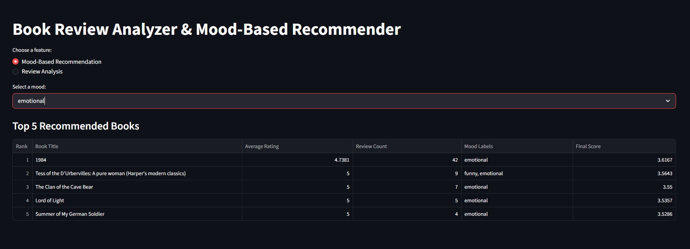
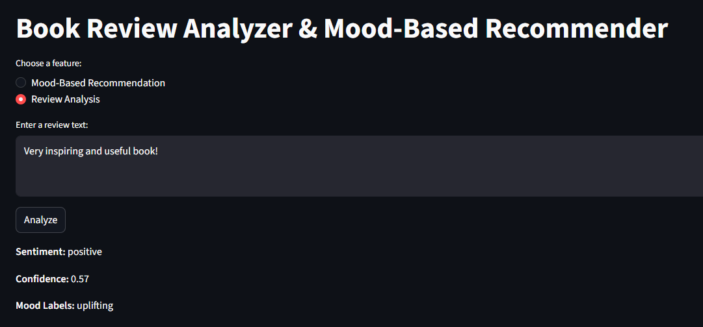

# 📚 Book Review Analyzer & Mood-Based Recommender

This project is an end-to-end data science application that analyzes book reviews and provides mood-based recommendations.

It combines data analysis, machine learning, and a simple web interface to create a usable system.

---

## 🚀 Features

- 📊 Exploratory Data Analysis (EDA) on Amazon book reviews  
- 🤖 Sentiment classification using TF-IDF + Logistic Regression  
- 🎭 Mood-based multi-label tagging (rule-based keyword detection)  
- 🌐 Interactive Streamlit web application  
  - Mood-based book recommendations  
  - Review sentiment and mood analysis  

---

## 🧠 Methodology

### 1. Data Preparation
- Dataset sampled to **20,000 rows** for efficiency  
- Cleaned by removing missing values and selecting relevant features  

### 2. Sentiment Analysis
- Ratings converted into:
  - Positive (4–5)
  - Neutral (3)
  - Negative (1–2)  
- Text vectorized using **TF-IDF (max 10,000 features)**  
- Model trained using **Logistic Regression (with class balancing)**  

### 3. Mood Labeling
- Five predefined mood categories:
  - uplifting  
  - dark  
  - funny  
  - emotional  
  - thought-provoking  
- Implemented using keyword-based multi-label classification  
- Supports multiple labels per review  

### 4. Application Layer
- Built with **Streamlit**  
- Allows users to:
  - Get book recommendations based on mood  
  
  - Analyze custom review text  
  

---

## 📊 Model Performance

- Accuracy: **0.76**  
- Weighted F1-score: **0.78**

The balanced Logistic Regression model was selected because it improves performance on minority classes such as neutral and negative reviews, resulting in a more balanced sentiment classification system.

---

## ⚙️ Installation

```bash
pip install -r requirements.txt
````

---

## ▶️ Usage

1. Make sure the dataset file `sample_books.csv` is inside the `data/` folder
2. Train the model:

```bash
python src/train_model.py
```

3. Run the application:

```bash
streamlit run app.py
```

---

## 📁 Project Structure

```
staj_project/
│
├── data/
│   └── sample_books.csv
│
├── models/
│   ├── sentiment_model.joblib
│   └── tfidf_vectorizer.joblib
│
├── notebooks/
│   └── eda.ipynb
│
├── src/
│   ├── train_model.py
│   ├── mood_labeler.py
│   ├── analyzer.py
│   └── test_analyzer.py
│
├── app.py
├── requirements.txt
└── README.md
```

---

## ⚠️ Limitations

* The dataset is imbalanced, with positive reviews dominating the data
* The sentiment model performs better on positive reviews than on neutral reviews
* Mood labeling is rule-based and depends on keyword coverage
* Recommendations are based on review-level patterns rather than personalized user preferences
* Author information was not included in the processed dataset used in this project

---

## 🚀 Future Improvements

* Use transformer-based models such as BERT or zero-shot classification for mood detection
* Improve neutral and negative sentiment detection
* Add personalized recommendation logic
* Integrate richer metadata (e.g., author, genre) into recommendations
* Deploy the application online

---

## 👩‍💻 Author

Salsabeel Alfayoumi

```


