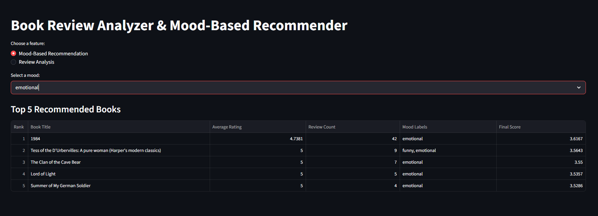
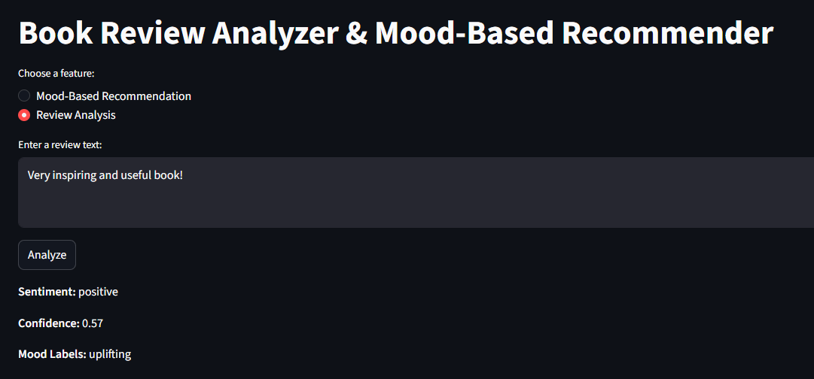

# Book Review Analyzer & Mood-Based Recommender

An end-to-end Python and NLP application that analyzes book-review sentiment and recommends books based on the reader's mood.

The project combines data preparation, exploratory analysis, machine learning, rule-based multi-label classification, and a deployable Streamlit interface.

[**Open the live demo**](https://book-review-analyzer-eekqesizeaplexpejnpcrb.streamlit.app/)

## Project at a glance

| Component | Implementation |
|---|---|
| Dataset | 20,000 sampled Amazon book reviews |
| Sentiment model | TF-IDF + class-balanced Logistic Regression |
| Mood analysis | Multi-label keyword-based classification |
| Interface | Streamlit |
| Sentiment accuracy | 0.76 |
| Weighted F1-score | 0.78 |

## What the application does

- Classifies a written review as positive, neutral, or negative
- Detects one or more mood signals in review text
- Recommends books for uplifting, dark, funny, emotional, or thought-provoking moods
- Presents the workflow through a simple interactive web application

## Application preview

### Mood-based recommendations



### Review analysis



## Methodology

### 1. Data preparation

The working dataset was sampled to 20,000 reviews for efficient experimentation. Missing values were removed and the relevant text, rating, and book fields were retained for analysis and modeling.

### 2. Sentiment classification

Ratings were mapped to three sentiment classes:

- **Positive:** ratings 4–5
- **Neutral:** rating 3
- **Negative:** ratings 1–2

Review text was converted into TF-IDF vectors with a maximum of 10,000 features. A class-balanced Logistic Regression model was selected to improve the treatment of minority neutral and negative examples.

### 3. Mood detection

Reviews can receive multiple mood labels. The current version uses transparent keyword rules for five categories:

- uplifting
- dark
- funny
- emotional
- thought-provoking

This makes the behavior easy to inspect while providing a useful baseline for future transformer-based experiments.

### 4. Application layer

The trained sentiment model, mood labeler, analyzer, and recommendation workflow are integrated into a Streamlit application for interactive use.

## Model results

The sentiment classifier achieved:

- **Accuracy:** 0.76
- **Weighted F1-score:** 0.78

The result reflects the imbalance in the source data: positive reviews dominate, while neutral reviews are more difficult to identify consistently. Class balancing was kept because it produces a more useful model across all three classes than optimizing only for the majority class.

## Technology

- Python
- Pandas
- Scikit-learn
- TF-IDF
- Logistic Regression
- Joblib
- Streamlit
- Jupyter Notebook

## Run locally

1. Clone the repository:

```bash
git clone https://github.com/salfayoumi/book-review-analyzer.git
cd book-review-analyzer
```

2. Install the dependencies:

```bash
pip install -r requirements.txt
```

3. Confirm that `data/sample_books.csv` is available, then train the model:

```bash
python src/train_model.py
```

4. Start the application:

```bash
streamlit run app.py
```

On Windows, `run_app.bat` provides an additional local launcher.

## Project structure

```text
book-review-analyzer/
├── data/
│   └── sample_books.csv
├── images/
│   ├── app1.png
│   └── app2.png
├── models/
│   ├── sentiment_model.joblib
│   └── tfidf_vectorizer.joblib
├── notebooks/
│   └── eda.ipynb
├── src/
│   ├── analyzer.py
│   ├── mood_labeler.py
│   ├── test_analyzer.py
│   └── train_model.py
├── app.py
├── requirements.txt
├── run_app.bat
└── README.md
```

## Limitations

- The dataset is dominated by positive reviews
- Neutral sentiment remains the most difficult class
- Mood detection depends on the coverage of the keyword rules
- Recommendations use review-level patterns rather than personal user history
- The processed dataset does not include richer metadata such as author and genre

## Next steps

- Compare the baseline with transformer-based sentiment models
- Evaluate zero-shot or supervised multi-label mood classification
- Add per-class evaluation and error analysis
- Incorporate author, genre, and reader-preference signals
- Add automated tests and continuous integration

## Author

**Salsabeel Alfayoumi**  
Computer Engineer focused on Python, applied AI, data analysis, and intelligent systems.

[Portfolio](https://salfayoumi.github.io/) · [GitHub profile](https://github.com/salfayoumi)
